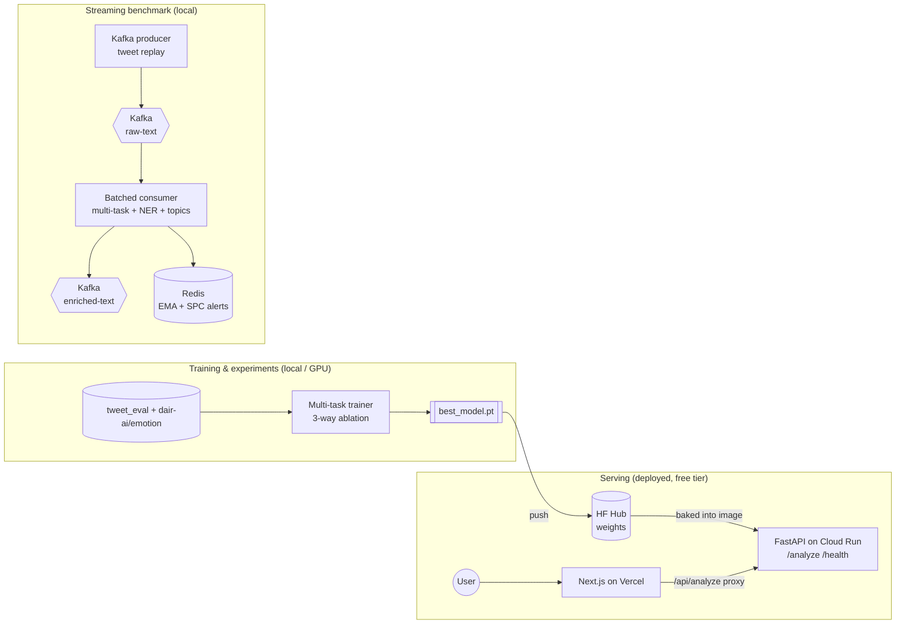

# NLP Pipeline at Scale — Real-Time Social Listening

> **Recruiter TL;DR**
> - **What it is:** a production, end-to-end NLP system that reads social-media text three ways at once — sentiment, emotion, and toxicity — from a *single* RoBERTa forward pass, plus named-entity extraction with brand normalization, streaming inference over Kafka, online topic modeling, and statistical anomaly detection.
> - **Hardest problem solved:** a shared-backbone **multi-task** model that matches three separate fine-tuned models on accuracy while using **3× fewer parameters and ~2× lower latency** — validated with a controlled 3-way ablation on held-out test data.
> - **Impact (measured):** live, free-tier deployment (Vercel + Google Cloud Run) serving real predictions; multi-task model = **125M params / 12.4ms p99** vs. a 373M / 27ms independent baseline at ~equal F1.

**▶️ Live demo:** **[nlp-pipeline-at-scale-shiv-a.vercel.app](https://nlp-pipeline-at-scale-shiv-a.vercel.app)** — type any text, watch it decode in real time.


A real-time social-listening pipeline that ingests a tweet stream via **Kafka**, runs **multi-task RoBERTa** inference (joint sentiment + emotion + toxicity in one forward pass), extracts named entities with brand normalization, assigns topics via **online incremental BERTopic**, and surfaces **brand-sentiment anomalies** with Statistical Process Control. Trained on real data (`cardiffnlp/tweet_eval`, `dair-ai/emotion`) — no synthetic datasets.

---

## Why this exists

Most NLP portfolio projects stop at a single-task notebook: fine-tune BERT on one dataset, print an F1, done. This project is deliberately the opposite — it takes a single model all the way from **research** (a controlled multi-task ablation) through **serving** (a streaming inference pipeline) to **deployment** (a live, publicly clickable demo), on **free tiers only**. The goal was to demonstrate the full lifecycle a production ML engineer owns — model design, evaluation rigor, a serving layer, benchmarking, and cloud deployment — not just the modeling step. It's a portfolio piece; the design choices are made to be defensible in an interview.

---

## Live demo & endpoints

| Piece | URL |
|---|---|
| Frontend (Next.js on **Vercel**) | https://nlp-pipeline-at-scale-shiv-a.vercel.app |
| Model API (FastAPI on **Google Cloud Run**) | https://nlp-pipeline-api-1061434430143.us-central1.run.app |
| Trained weights (**Hugging Face Hub**) | https://huggingface.co/shiva-1993/nlp-pipeline-multitask |

The backend is scale-to-zero, so the **first request after idle takes ~15–20s** to warm the model; subsequent requests are ~300–600ms.

---

## Features

- **Multi-task inference in one forward pass** — one RoBERTa backbone, three classification heads: 3-class sentiment, 6-class emotion, binary toxicity.
- **Uncertainty-weighted loss** — learned per-task loss weights via homoscedastic uncertainty (Kendall et al., 2018), compared head-to-head against equal weighting and separate models.
- **Named-entity recognition + brand normalization** — `dslim/bert-base-NER` spans mapped to canonical brand IDs (e.g. `Apple`, `$AAPL` → `brand:apple`).
- **Streaming inference** — a Kafka producer replays real tweets at a target rate; a batched consumer enriches them and writes to a downstream topic + Redis.
- **Online topic modeling** — incremental BERTopic (`partial_fit` per batch) with topic-velocity (trending) tracking.
- **Anomaly detection** — an EWMA-style control check per brand fires an alert when sentiment drops beyond a z-score threshold for consecutive observations.
- **Active learning** — entropy-based uncertainty sampling vs. random, measured as an accuracy-vs-labels curve.
- **Serving layer** — FastAPI `/analyze` returns full per-class probability distributions; a Next.js frontend renders them.

---

## Architecture

Three concerns, deliberately separated: **experiments** (run locally / on GPU, results committed), **serving** (a lean stateless API), and **streaming** (a local Kafka benchmark). Only the serving slice is deployed — streaming and training don't belong on a free serverless tier, and pretending otherwise would be dishonest about cost.



**Why the frontend proxies through its own `/api/analyze`:** the browser never sees the backend URL — a Next.js server route forwards to Cloud Run, which keeps the API origin server-side and avoids CORS.

**Why a separate NER model instead of a 4th head:** NER produces token-level span outputs (start/end/type), a different objective from the document-level classification heads. In production, NER typically runs as its own lighter-weight service.

---

## Key Results

Real numbers from a full run on a single RTX 4060 (`roberta-base`, 5 epochs, fp16). Reproduce with the scripts below. All metrics are **macro-F1 on the held-out test split** of each task; all three strategies use a pretrained backbone and identical 2-layer MLP heads, so the only variable is backbone **sharing** and loss **weighting**.

### Multi-task ablation

| Strategy | Sentiment F1 | Emotion F1 | Toxicity F1 | Latency p99 | Params |
|---|---|---|---|---|---|
| Independent (3 separate models) | **0.709** | 0.879 | **0.491** | 27.0 ms (3× fwd) | 373 M |
| Hard sharing (equal weights) | 0.700 | 0.884 | 0.478 | 12.6 ms | 125 M |
| **Uncertainty weighted** | 0.700 | **0.888** | 0.473 | **12.4 ms** | 125 M |

**Takeaway:** one shared backbone matches three separate models within ~1 F1 point on every task at **3× fewer parameters and ~2× lower latency**. The efficiency win is the headline; accuracy is a wash. (Toxicity F1 is low across the board — the `tweet_eval/hate` test set has a known train→test distribution shift; validation F1 was ~0.78. We report **test** to stay honest.)

### Throughput vs. latency benchmark

Saturation point ≈ **1500 msg/s** — the consumer keeps up 1:1 to ~1000 msg/s, plateaus at a max sustained ~1250 msg/s, then queue lag grows unbounded. Per-message inference p99 ≈ 1.0 ms.

### Active learning

Entropy-based uncertainty sampling vs. random (sentiment, seed 200, +50/round × 10). Honest, mixed result: uncertainty sampling is **statistically on par with random** at this small query-batch scale — both reach ~0.63 F1 at 700 labels. A useful negative result, not an inflated win.

---

## Tech stack

| Layer | Choice | Why |
|---|---|---|
| Model | PyTorch, `transformers`, `roberta-base` | Standard, strong baseline for tweet-domain text |
| Serving | FastAPI + Uvicorn | Async, typed request/response, cheap to containerize |
| Frontend | Next.js (App Router, TypeScript) | Server proxy hides the backend URL; deploys free on Vercel |
| Streaming | Kafka (`kafka-python`), Redis | Decouples ingestion from inference; batched consumer for throughput |
| Topics | BERTopic + UMAP + HDBSCAN | Online `partial_fit` for a streaming setting |
| Experiment tracking | MLflow | Per-run metrics/artifacts for the ablation |
| Deploy | Docker, GCP Cloud Run, Vercel, HF Hub | All free tier; weights pulled from the Hub, not committed |
| Quality | pytest, ruff, GitHub Actions | Fast unit tests + lint on every push |

---

## Skills demonstrated

- **Production ML deployment / MLOps** — model serving decoupled from training; weights versioned on the HF Hub and baked into the serving image.
- **Cloud deployment (Google Cloud Run)** — containerized, scale-to-zero, public HTTPS service.
- **Containerization & Docker** — separate images for local multi-service dev and the lean serving build.
- **CI/CD** — GitHub Actions running ruff + pytest on every push/PR.
- **RESTful API design** — FastAPI with typed schemas and multiple endpoints.
- **Data engineering / streaming** — Kafka producer→consumer pipeline moving raw text to enriched records.
- **Asynchronous / concurrent systems** — batched Kafka consumer, async FastAPI, token-bucket rate limiting.
- **System design & tradeoff reasoning** — controlled multi-task ablation; documented why serving, streaming, and training are separated.
- **Automated testing (TDD)** — regression tests that pin the loss-masking contract, SPC math, and active-learning acquisition.
- **Deep learning research** — multi-task learning, uncertainty-weighted loss, active learning, entropy-based acquisition.

---

## Getting started

```bash
git clone https://github.com/shiva-shivanibokka/NLP-Pipeline-at-Scale
cd NLP-Pipeline-at-Scale
pip install -r requirements.txt
cp .env.example .env
```

### Run the experiments

```bash
# 3-way multi-task ablation (add --smoke for a fast 1-epoch/500-example sanity run)
python scripts/run_ablation.py

# Throughput/latency benchmark (simulation mode, no Kafka required)
python scripts/run_benchmark.py

# Active-learning comparison (uncertainty vs. random)
python scripts/run_active_learning.py
```

### Run the API locally

```bash
uvicorn api.main:app --reload --port 8000
# set MODEL_CKPT_PATH to a trained best_model.pt, or HF_MODEL_REPO to pull from the Hub
```

### Run the frontend locally

```bash
cd frontend
npm install
cp .env.example .env.local     # point MODEL_API_URL at your API
npm run dev                    # http://localhost:3000
```

### Full local stack (Kafka + Redis + API + UI + MLflow)

```bash
cd docker && docker-compose up
```

---

## Usage

```bash
curl -X POST https://nlp-pipeline-at-scale-shiv-a.vercel.app/api/analyze \
  -H "Content-Type: application/json" \
  -d '{"text": "I love the new update from Apple, best ever!"}'
```

```json
{
  "sentiment": "positive", "sentiment_probs": {"negative": 0.00, "neutral": 0.01, "positive": 0.99},
  "emotion": "joy",        "emotion_probs": {"joy": 0.58, "surprise": 0.30, "...": 0.0},
  "toxicity": "not_toxic",  "toxicity_probs": {"not_toxic": 0.98, "toxic": 0.02},
  "uncertainty": 0.37,
  "entities": [{"text": "Apple", "entity_type": "ORG", "score": 0.999, "canonical_id": "brand:apple"}],
  "inference_latency_ms": 619.13
}
```

---

## Project structure

```
NLP-Pipeline-at-Scale/
├── src/model/            # MultiTaskRoBERTa (1 backbone + 3 heads), dataset, 3-way ablation trainer
├── src/streaming/        # Kafka producer (tweet replay) + batched enriching consumer
├── src/ner/              # dslim/bert-base-NER + brand normalization table
├── src/topics/           # incremental online BERTopic + topic velocity
├── src/aggregation/      # Redis-backed EMA sentiment + SPC anomaly detection
├── src/benchmark/        # throughput/latency degradation curve
├── src/active_learning/  # entropy sampling vs. random
├── scripts/              # run_ablation / run_benchmark / run_active_learning
├── api/main.py           # FastAPI serving layer (/analyze, /health, /brands, /topics, /alerts)
├── app/gradio_app.py     # Gradio dashboard (local)
├── frontend/             # Next.js app → Vercel
├── tests/                # pytest: loss masking, SPC, active-learning acquisition
├── results/              # committed experiment outputs (ablation / benchmark / AL)
├── Dockerfile            # Cloud Run serving image (bakes weights + models at build)
├── deploy/hf-space/      # (legacy) HF Space setup notes
└── docker/               # docker-compose for the full local stack
```

---

## Testing

```bash
pip install -r requirements-dev.txt
pytest          # 7 tests across 3 files
ruff check .
```

Coverage is focused, not exhaustive — the tests pin the parts most likely to break silently: the multi-task **loss-masking contract** (each head only trains on examples that carry its label), the **SPC** alert math, and the **active-learning** acquisition function. GitHub Actions runs `ruff` + `pytest` on every push and PR (`.github/workflows/ci.yml`).

---

## Deployment

**Fully deployed on free tiers** — no Render/Supabase/Fly, no paid services.

- **Backend** → FastAPI on **Google Cloud Run** (scale-to-zero). The Docker image bakes the trained weights + `roberta-base` + the NER model in at build time (pulled from the HF Hub on GCP's network), so cold starts do no network I/O.
- **Frontend** → Next.js on **Vercel**, git-connected for auto-deploys, with the model API URL kept server-side.
- **Weights** → pushed to the **HF Hub**, downloaded at build (never committed to git).
- **Streaming + benchmark** → run **locally** via `docker-compose`; results are committed as reproducible evidence rather than hosted as a live cost.

See `deploy/hf-space/SETUP.md` for the (now legacy) HF Space notes — HF Docker Spaces became paid-only, which is why the backend moved to Cloud Run.

---

## Roadmap / known limitations

- **NER is case-sensitive** (`dslim/bert-base-NER`) and the brand table covers ~8 companies — casually-typed lowercase text (`mc donalds`) won't be tagged. An uncased NER model and an expanded brand list would fix this.
- **Toxicity generalization** is limited by the `tweet_eval/hate` train→test shift (test F1 ~0.49); a broader toxicity dataset would help.
- **Logging** is `print`-based, not structured; there's a `/health` endpoint but no metrics/tracing.
- **Cold starts** (~15–20s) are inherent to free scale-to-zero; a warm min-instance would remove them (paid).
- Active-learning result is a single seed; multiple seeds + larger query batches would strengthen the comparison.

---

## License

No license file is currently included — the code is shared for portfolio/review purposes. Contact the author before reuse.

---

## References

- [Multi-Task Learning Using Uncertainty to Weigh Losses (Kendall et al., CVPR 2018)](https://arxiv.org/abs/1705.07115)
- [Active Learning Literature Survey (Settles, 2009)](https://burrsettles.com/pub/settles.activelearning.pdf)
- [BERTopic: Neural Topic Modeling (Grootendorst, 2022)](https://arxiv.org/abs/2203.05794)
- [EWMA Control Charts (Montgomery, 2009)](https://www.wiley.com/en-us/Introduction+to+Statistical+Quality+Control-p-9781118146811)
- [TweetEval benchmark (Barbieri et al., 2020)](https://arxiv.org/abs/2010.12421)

---

*Built by Shivani Bokka — multi-task RoBERTa, trained in PyTorch, served on Cloud Run + Vercel.*
